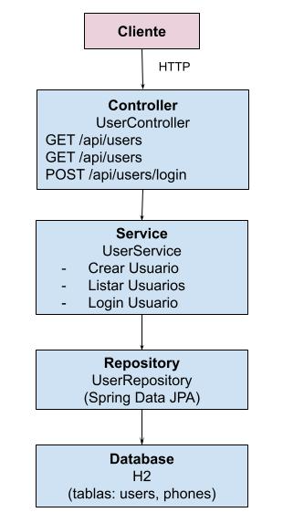

# Users API RESTful
API RESTful para creación de usuarios, incluyendo registro, validaciones y autenticación mediante tokens.
Todos los endpoints consumen y retornan JSON y manejan mensajes de error estructurados.

## Descripción
Esta aplicación permite:

- Crear usuarios con nombre, correo, contraseña y teléfonos.
- Validar correo y contraseña mediante expresiones regulares configurables.
- Generar y persistir un token de acceso para cada usuario.
- Retornar respuestas claras y estructuradas en JSON, incluyendo mensajes de error.
- Almacenar los datos en una base de datos en memoria (H2/Hibernate) usando Spring Boot y JPA.

## Tecnologías
- Java 8+
- Spring Boot
- Spring Security
- JWT para tokens
- H2 (base de datos en memoria)
- JPA
- Gradle
- Swagger
- JUnit y Mockito para pruebas unitarias

## Instalación
Clonar el repositorio:
```
git clone git@github.com:oshingc/create-user-api.git
```

## Construir el proyecto:
### Gradle
```
./gradlew build
```

## Ejecutar la aplicación:
### Gradle
```
./gradlew bootRun
```

## Generación de JWT Secret
```
node -e "console.log(require('crypto').randomBytes(32).toString('hex'))"
```
1. Copia la string generada.
2. Abre el archivo application.properties para setear el JWT Secret Key.
```
jwt.secret=paste-the-generated-string-here
```
Reemplaza paste-the-generated-string-here con la string que copiaste.

## Swagger
Documentación de la API generada por Swagger:
http://localhost:8080/swagger-ui.html

## Endpoints
### 1. Crear Usuario
```
   POST /api/users
```

   Request JSON
```json
   {
   "name": "Juan Rodriguez",
   "email": "juan@rodriguez.org",
   "password": "hunter2",
   "phones": [
       {
       "number": "1234567",
       "citycode": "1",
       "contrycode": "57"
       }
   ]
   }
```
Success Response (201):
```json
   {
   "id": "uuid-generado",
   "name": "Juan Rodriguez",
   "email": "juan@rodriguez.org",
   "created": "2025-10-29T10:00:00",
   "modified": "2025-10-29T10:00:00",
   "last_login": "2025-10-29T10:00:00",
   "token": "jwt-token",
   "isactive": true,
   "phones": [
       {
       "number": "1234567",
       "citycode": "1",
       "contrycode": "57"
       }
   ]
   }
   ```

   Errores (con mensaje):

```
   { "mensaje": "El correo ya registrado" }
   { "mensaje": "Formato de correo electrónico inválido" }
   { "mensaje": "Formato de contraseña inválido" }
   { "mensaje": "La solicitud no puede ser nula" }
```

### 2. Listar Usuarios
```
   GET /api/users
```

Success Response (200):
```json
   {
   "id": "uuid-generado",
   "name": "Juan Rodriguez",
   "email": "juan@rodriguez.org",
   "created": "2025-10-29T10:00:00",
   "modified": "2025-10-29T10:00:00",
   "last_login": "2025-10-29T10:00:00",
   "token": "jwt-token",
   "isactive": true,
   "phones": [
       {
       "number": "1234567",
       "citycode": "1",
       "contrycode": "57"
       }
   ]
   }
   ```


### 3. Login Usuario
```
   POST /api/users/login
```

Request JSON
```json
   {
   "email": "juan@rodriguez.org",
   "password": "hunter2"
   }
```
Success Response (200):
```json
   {
   "id": "01c4730f-c887-4726-9989-7099dad057f6",
   "name": "Juan Rodriguez",
   "email": "juan@rodriguez.org",
   "token": "jwt-token",
   "lastLogin": "2025-10-30T09:33:19.951811",
   "isActive": true
}
   ```

Errores (con mensaje):

```
   { "mensaje": ""Usuario no encontrado"" }
   { "mensaje": "La contraseña es obligatoria" }
   { "mensaje": "La contraseña es incorrecta" }
```

### Autenticación
   Los endpoints protegidos requieren el header Authorization: Bearer <token>.
   El token se genera automáticamente al registrar el usuario.
   JWT utilizado para validar autenticidad y expiración. 
   
### Pruebas Unitarias
   Se incluyen pruebas para:
   - Validación de email y contraseña.
   - Usuario existente.
   - Token generado correctamente.
   - Creación exitosa de usuario.
   - Creación con solicitud nula.
   - Persistencia de teléfonos.
   

## Estructura del Proyecto
```
   src/
   ├─ main/
   │  ├─ java/com/users/demo/
   │  │  ├─ controller/
   │  │  ├─ service/
   │  │  ├─ repository/
   │  │  ├─ security/
   │  │  ├─ model/
   │  │  │  │─ dto/ 
   │  │  │  │─ entity/
   │  │  ├─ validation/
   │  │  │─ config/
   │  │  │─ util/
   │  │  └─ exception/
   │  └─ resources/
   │     └─ application.properties
   └─ test/
   └─ java/com/users/demo/
   └─ UserServiceTest.java
 ```
### Base de Datos
   - En memoria: H2
   - No requiere configuración adicional
   - Cuenta con script de creación de Base de Datos (resources/schema.sql).
   - Esquema generado automáticamente mediante JPA/Hibernate

### Acceso a Base de Datos h2
http://localhost:8080/h2-console/
 ```
JDBC URL:jdbc:h2:mem:testdb
username:sa
password:<empty>
 ```


### Notas
   - Todos los endpoints retornan JSON, incluso errores.
   - Los mensajes de error están en español y siguen un formato consistente.
   - JWT utilizado para autenticación y autorización.
   - Se recomienda probar con Postman o Swagger.

### Diagrama de Arquitectura



### Modelo de Base de Datos


### Flujo de creación de usuario

